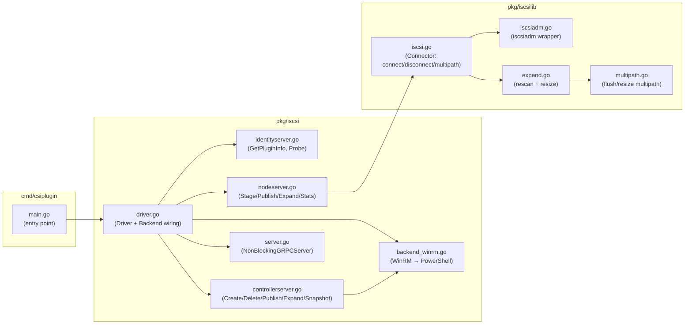
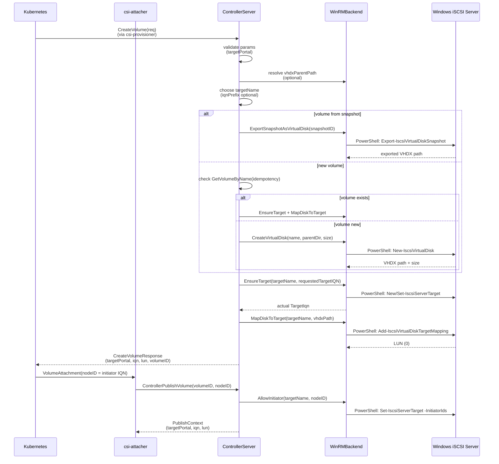
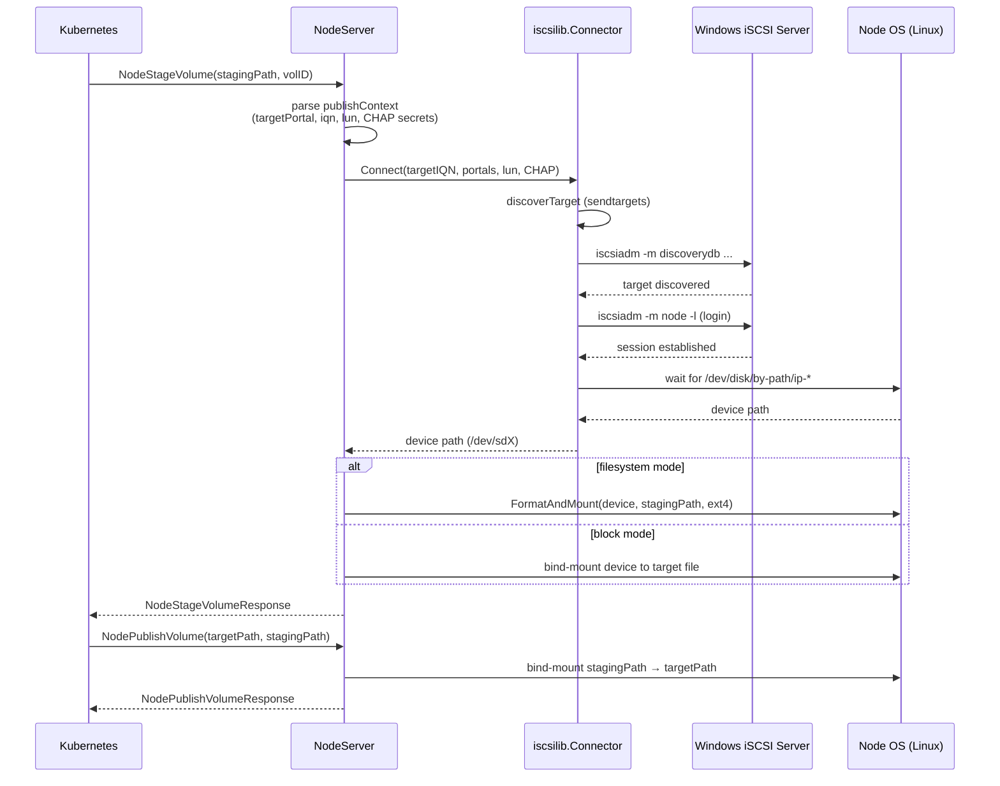

# Architecture

## System Overview

```mermaid
graph TB
    subgraph KubernetesCluster["Kubernetes Cluster"]
        subgraph ControlPlane["Control Plane"]
            APIServer["API Server"]
            CSIDriver["CSI Driver Object<br/>(iscsi.csi.windows.microsoft.com)"]
        end

        subgraph ControllerPod["Controller Pod<br/>(deployment-controller.yaml)"]
            Provisioner["csi-provisioner"]
            Attacher["csi-attacher"]
            Controller["ControllerServer<br/>(controllerserver.go)"]
            WinRMBackend["WinRMBackend<br/>(backend_winrm.go)"]
        end

        subgraph NodePod["Node Pod<br/>(daemonset-node.yaml)"]
            Registrar["node-driver-registrar"]
            NodeServer["NodeServer<br/>(nodeserver.go)"]
            iSCSILib["iscsilib<br/>(iscsi.go / iscsiadm.go)"]
            Mounter["mount-utils<br/>(FormatAndMount / ResizeFs)"]
        end

        subgraph WindowsHost["Windows iSCSI Storage Server<br/>(external host)"]
            iSCSITarget["iSCSI Target Server<br/>(Windows Feature)"]
            VHDXStore["VHDX Storage<br/>(vhdxParentPath)"]
        end
    end

    APIServer --> CSIDriver
    APIServer --> Provisioner
    APIServer --> Attacher
    APIServer --> Registrar
    Provisioner ==>|CSI gRPC| Controller
    Attacher ==>|CSI gRPC| Controller
    APIServer ==>|CSI gRPC via kubelet| NodeServer

    Controller -->|WinRM (HTTP-ES)| WinRMBackend
    WinRMBackend -->|PowerShell / IscsiTarget| iSCSITarget

    WinRMBackend -.->|CreateVirtualDisk| VHDXStore
    WinRMBackend -.->|DeleteVirtualDisk| VHDXStore

    NodeServer --> iSCSILib
    iSCSILib -->|iscsiadm CLI| iSCSITarget
    iSCSILib -->|blockdev / lsblk| NodeOS["Node OS<br/>(Linux)"]
    Mounter --> NodeOS

    Controller -. Volume lifecycle .-> WinRMBackend
    NodeServer -. Volume attach/mount .-> iSCSILib

    style KubernetesCluster fill:#e1f5fe
    style ControlPlane fill:#fff3e0
    style ControllerPod fill:#e8f5e9
    style NodePod fill:#f3e5f5
    style WindowsHost fill:#ffebee
    style iSCSITarget fill:#fff9c4
```

## Component Responsibilities



## Controller Volume Creation Flow



## Node Attach / Mount Flow



## gRPC Endpoint Summary

| Server | Interface | RPCs Implemented |
|---|---|---|
| **IdentityServer** | CSI probe endpoint | `GetPluginInfo`, `Probe`, `GetPluginCapabilities` |
| **ControllerServer** | CSI controller endpoint | `Create/DeleteVolume`, `ControllerPublish/UnpublishVolume`, `Create/Delete/ListSnapshots`, `ControllerExpandVolume`, `ValidateVolumeCapabilities`, `GetCapacity`, `ControllerGetVolume` |
| **NodeServer** | CSI node endpoint | `NodeStage/UnstageVolume`, `NodePublish/UnpublishVolume`, `NodeGetInfo/GetCapabilities`, `NodeGetVolumeStats`, `NodeExpandVolume` |

## Key Data Flows

### Volume ID Encoding
```
volumeID = base64.RawURLEncode(
  {
    "name":     <volumeName>,
    "targetPortal": <host:port>,
    "targetName": <Windows TargetName>,
    "targetIQN":  <Windows TargetIqn>,
    "lun":        0,
    "vhdxPath":   <Windows server path>,
    "sizeBytes":  <capacity>
  }
)
```

### Snapshot ID Encoding
```
snapshotID = base64.RawURLEncode(
  {
    "snapshotId":  <GUID>,
    "originalPath": <VHDX path>
  }
)
```

### WinRM Backend (Controller → Windows)
The controller communicates with the Windows iSCSI Storage Server via **WinRM** (Windows Remote Management):

| Env Var | Purpose | Default |
|---|---|---|
| `WINRM_HOST` | Windows server hostname | *(required)* |
| `WINRM_PORT` | WinRM port | `5986` (TLS) / `5985` (non-TLS) |
| `WINRM_TLS` | Use HTTPS | `false` |
| `WINRM_INSECURE` | Accept self-signed certs | `true` |
| `WINRM_USER` / `WINRM_PASSWORD` | Auth credentials | *(required)* |
| `WINRM_AUTH` | Auth mode: `basic` or `ntlm` | `basic` |
| `WINRM_TIMEOUT` | PowerShell command timeout | `60s` |

Each backend method wraps a PowerShell script using the `IscsiTarget` module and returns JSON.

### Node iSCSI Initiation (Node → Windows)
The node pod runs on **Linux** and connects to the Windows iSCSI target using:
- `iscsiadm` CLI (sendtargets discovery, node login/logout)
- `lsblk` / `blockdev` for device enumeration
- `multipath` tools for multipath awareness
- `resize2fs` / `xfs_growfs` via `mount.ResizeFs` for filesystem expansion
